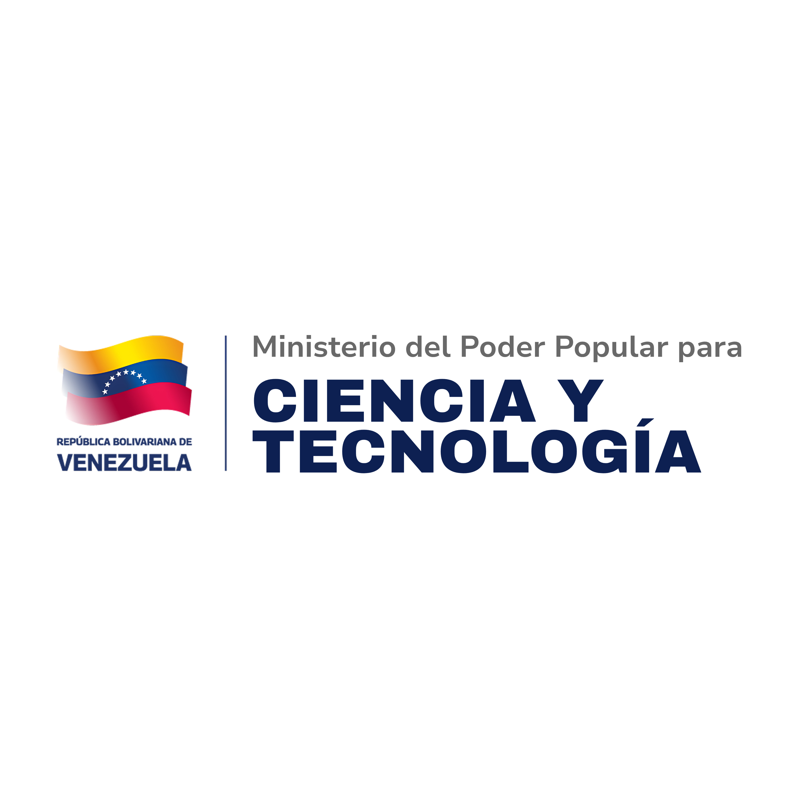

  <a href="https://repouptpc.github.io/" target="_blank">
    
    &nbsp;&nbsp;&nbsp;&nbsp;&nbsp;&nbsp;&nbsp;&nbsp;
    
  </a>

  # 🇻🇪 REPOUPTPC
  ### Universidad Politécnica Territorial de Puerto Cabello (UPTPC)
  **Unidad de Ciencia y Tecnología**

  
  
  

  ---

  > 🔬 *"En la Universidad Politécnica Territorial de Puerto Cabello, ¡también somos ciencia para la vida!"*

 

## 🏛️ Distintivos Institucionales

* 🏛️ **Miembro activo del Consejo Científico Estadal de Carabobo**
* 🔬 **En línea con la Gran Misión Ciencia y Tecnología**
* 🇻🇪 **Soberanía Tecnológica y Desarrollo Territorial de Puerto Cabello, Estado Carabobo**

---

## ⚡ Creación Automatizada de Repositorios

Invitamos a todos los estudiantes, profesores e investigadores de la **UPTPC** a utilizar nuestro sistema web de automatización para generar la estructura estandarizada de sus proyectos académicos e investigativos:

* 🚀 **Plataforma de Automatización:** [https://uptpc.github.io/proyecto-automatizacion/](https://uptpc.github.io/proyecto-automatizacion/)
* 📦 **Organización de Destino:** Los nuevos repositorios serán alojados oficialmente en **[https://github.com/UPTPC](https://github.com/UPTPC)**
* 📖 **Guía y Manual de Usuario:** [Ver guía oficial en el Portal UPTPC](https://www.uptpc.edu.ve/ciencia-y-tecnolog%C3%ADa/repositorios-github)

---

## 🌐 Enlaces y Recursos de Interés

| Recurso | Descripción | Enlace |
| :--- | :--- | :--- |
| **Portal Principal** | Sitio web oficial desplegado en GitHub Pages | [repouptpc.github.io](https://repouptpc.github.io/) |
| **Creador de Repos** | Asistente automatizado para nuevos proyectos | [proyecto-automatizacion](https://uptpc.github.io/proyecto-automatizacion/) |
| **Organización UPTPC** | Repositorio central de proyectos de la Universidad | [github.com/UPTPC](https://github.com/UPTPC) |
| **Portal Web UPTPC** | Sitio institucional de la Universidad | [www.uptpc.edu.ve](https://www.uptpc.edu.ve/) |
| **Instrucciones GitHub** | Tutorial detallado de uso y políticas | [Guía UPTPC](https://www.uptpc.edu.ve/ciencia-y-tecnolog%C3%ADa/repositorios-github) |

---

## 📍 Ubicación Institucional & Datos Fiscales

**Universidad Politécnica Territorial de Puerto Cabello UPTPC**  
Calle principal Edif. IUTPC Zona Industrial Santa Rosa, Circuito Comunal 8, Parroquia Juan José Flores, Puerto Cabello, Estado Carabobo, Venezuela.  
**RIF:** `G-20005608-8`

 

  
  &nbsp;&nbsp;&nbsp;&nbsp;&nbsp;&nbsp;&nbsp;&nbsp;
  

 

---

**Jose Herrera**  
Unidad de Ciencia y Tecnología UPTPC  
[cienciaytecnologia@uptpc.edu.ve](mailto:cienciaytecnologia@uptpc.edu.ve)
